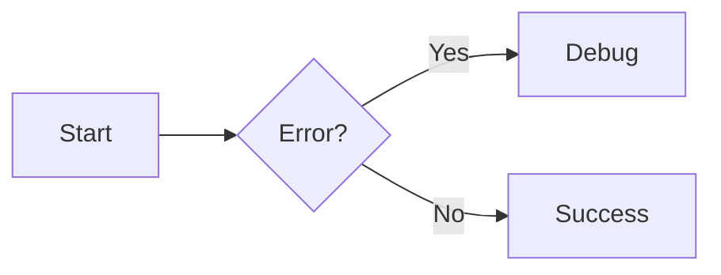

# Mermaid 图表不显示？你可能踩了这个坑

在使用 [Material for MkDocs](https://squidfunk.github.io/mkdocs-material/) 编写技术文档时，我们常常希望通过 Mermaid 语法绘制流程图、序列图等，提升文档可读性。

然而，即使配置看似正确，图表仍可能**只显示为代码块，无法渲染成图形**。本文记录一次典型的配置失误及解决方案，希望能帮你少走弯路。

---

## 🐞 问题现象

在 Markdown 文件中使用 Mermaid 语法：

```


但页面输出结果却是：

> 图表未被渲染，仅显示为普通代码块。

---

## 🔍 排查过程

我们确认了以下几点：

- 使用的是 **Material for MkDocs ≥ 8.2.0**（支持原生 Mermaid）
- 已启用 `pymdownx.superfences`
- 未手动引入 Mermaid.js（正确，应由主题自动加载）
- 浏览器控制台无 JS 报错

但图表依然不渲染。

通过使用浏览器开发工具定位到图表相关元素如下。
```
<pre class="mermaid-experimental" id="__code_0"><button class="md-clipboard md-icon" title="复制" data-clipboard-target="#__code_0 &gt; code"></button><code>graph LR
  A[Start] --&gt; B{Error?};
  B --&gt;|Yes| C[Hmm...];
  C --&gt; D[Debug];
  D --&gt; B;
  B ----&gt;|No| E[Yay!];</code></pre>
```


---

## 🧩 根本原因：`class` 写错了！

问题出在 `mkdocs.yml` 的配置中：

```yaml
markdown_extensions:
  - pymdownx.superfences:
      custom_fences:
        - name: mermaid
          class: mermaid-experimental   # ❌ 错了！（被过时的第三方博客误导）
          format: !!python/name:pymdownx.superfences.fence_code_format
```

### ❌ 错误点

Material for MkDocs **只会自动初始化 `class: "mermaid"` 的代码块**。  
你写成 `mermaid-experimental`，主题就“不认识”这个块，**不会触发 Mermaid.js 加载**。

> 即使名字是 `mermaid`，只要 `class` 不是 `mermaid`，就不会渲染！

---

## ✅ 正确配置

将 `class` 改为 `mermaid`：

```yaml
markdown_extensions:
  - pymdownx.superfences:
      custom_fences:
        - name: mermaid
          class: mermaid                    # ✅ 必须是 "mermaid"
          format: !!python/name:pymdownx.superfences.fence_code_format
```

> ✅ 保存后重启 `mkdocs serve`，图表立即正常渲染！

---

## 📌 关键知识点

| 项目 | 说明 |
|------|------|
| **Material ≥ 8.2.0** | 原生支持 Mermaid，无需手动引入 JS |
| **不要用 `mermaid-experimental`** | 除非你手动初始化 Mermaid |

---

## ✅ 总结

> **`class: mermaid` 是触发自动渲染的“钥匙”**。

只要记住这一点，就能避免 90% 的 Mermaid 不显示问题。  
不要再让 `mermaid-experimental` 偷走你的图表了！

---

> 📚 **相关文档**：
> - [Material for MkDocs - Mermaid 支持](https://squidfunk.github.io/mkdocs-material/reference/diagrams/#mermaid)
> - [pymdown-extensions - SuperFences](https://facelessuser.github.io/pymdown-extensions/extensions/superfences/)
```